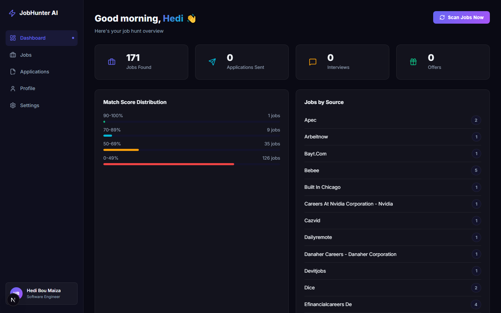

# JobHunter AI

[](https://github.com/hediipor/JobHunter)
[](https://github.com/hediipor/JobHunter/commits/main)
[](backend)
[](frontend)
[](https://ai.google.dev)

An end-to-end personal job-hunting autopilot: it scans job boards on a
schedule, scores every posting against your profile, and — with one click —
generates a tailored CV and cover letter and emails the application.

It scrapes job postings (via the
[JSearch](https://rapidapi.com/letscrape-6bRBa3QguO5/api/jsearch) API and a
Keejob.com scraper), scores them against your profile, generates a tailored
CV and cover letter with an LLM (Gemini, Groq or OpenRouter), and sends the
application email — all from a FastAPI backend and a Next.js dashboard.



## Setup

### 1. Backend

```bash
cd backend
python -m venv ../.venv
../.venv/Scripts/activate  # Windows; use `source ../.venv/bin/activate` on macOS/Linux
pip install -r requirements.txt
```

Copy `.env.example` to `.env` in the project root and fill in:

- LLM keys — any one is enough; more means more free quota:
  - `GROQ_API_KEY` — [Groq console](https://console.groq.com/keys) (recommended: free, handles job scoring)
  - `GEMINI_API_KEY` — [Google AI Studio](https://aistudio.google.com/apikey)
  - `OPENROUTER_API_KEY` — [OpenRouter](https://openrouter.ai/keys) (optional fallback)
- `GMAIL_APP_PASSWORD` — a [Gmail App Password](https://support.google.com/accounts/answer/185833) (not your login password)
- `RAPIDAPI_KEY` — subscribe to [JSearch](https://rapidapi.com/letscrape-6bRBa3QguO5/api/jsearch) (free tier: 200 requests/month)

Copy `profile/profile.example.json` to `profile/profile.json` and fill in
your own name, contact details, education, experience, projects, and skills
— this is what the matcher scores jobs against and what your LLM (Gemini
first, then Groq, then OpenRouter) uses to generate your CV and cover letter.

Run the API:

```bash
uvicorn main:app --reload --port 8000
```

### 2. Frontend

```bash
cd frontend
npm install
npm run dev
```

Open [http://localhost:3000](http://localhost:3000).

## How it works

1. **Scan** — pulls postings from every enabled source (one module each in
   `backend/sources/`: JSearch for LinkedIn/Indeed/Glassdoor and more, and
   Keejob.com) on a schedule you set in the Settings page (default: every
   48h, to stay within JSearch's free tier of ~200 requests/month). Jobs are
   deduplicated by URL and across sources by title + company + location; the job page
   shows the other boards a posting was seen on under "Also listed on".
2. **AI fit check** — every new job is assessed by an LLM (Groq, falling back
   to Gemini / OpenRouter): a 0–100 fit score for your actual level and stack,
   a one-line verdict, visa sponsorship and dealbreakers. Jobs not assessed
   yet (e.g. the day's free quota ran out) show as "pending AI check".
3. **Generate** — the LLM tailors a CV and cover letter to the specific job
   (using only what's in your profile — it won't invent experience), turned
   into ATS-friendly PDFs.
4. **Apply** — sends the application email with both PDFs attached via
   Gmail SMTP.

Track everything — new jobs, generated documents, sent applications,
interview/offer status — from the dashboard.

## Development

```bash
pip install -r backend/requirements-dev.txt
cd backend
pytest
```
